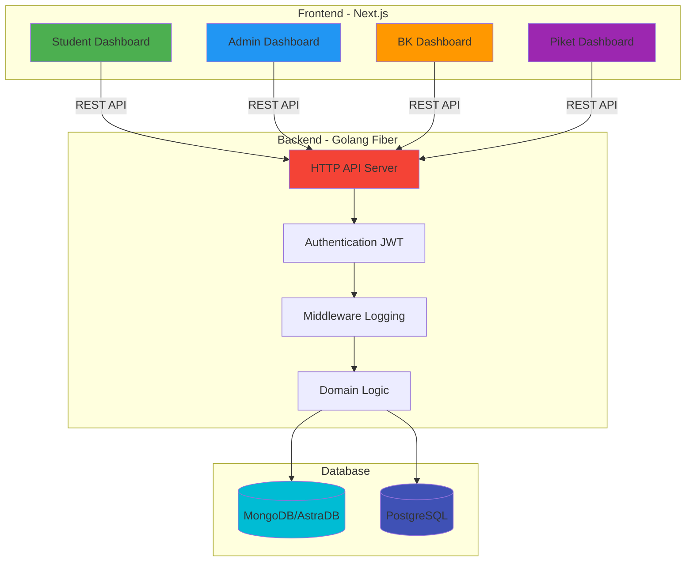
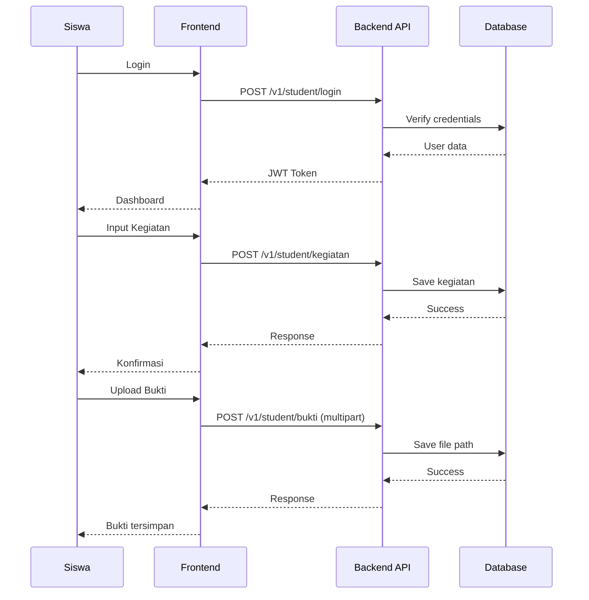

# GR31 - Sistem Monitoring 7 Kebiasaan Anak Indonesia Hebat


Sistem monitoring dan pelaporan kegiatan harian siswa berbasis 7 Kebiasaan Anak Indonesia Hebat untuk SMKN 31 Jakarta.

## Arsitektur Sistem



## 7 Kebiasaan Anak Indonesia Hebat

<table>
<tr>
<td align="center" width="14%">
<br>
<b>Bangun Pagi</b>
</td>
<td align="center" width="14%">
<br>
<b>Beribadah</b>
</td>
<td align="center" width="14%">
<br>
<b>Belajar</b>
</td>
<td align="center" width="14%">
<br>
<b>Makan Sehat</b>
</td>
<td align="center" width="14%">
<br>
<b>Olahraga</b>
</td>
<td align="center" width="14%">
<br>
<b>Bermasyarakat</b>
</td>
<td align="center" width="14%">
<br>
<b>Tidur Cukup</b>
</td>
</tr>
</table>

## Fitur Utama

### Untuk Siswa

- ✅ Input kegiatan harian 7 kebiasaan
- 📸 Upload bukti foto kegiatan
- 📊 Lihat progress pribadi
- 💬 Sistem aduan ke BK
- 📍 Absensi dengan geolocation

### Untuk Admin

- 👥 Manajemen data siswa dan admin
- 📈 Monitoring kegiatan semua siswa
- 📋 Laporan bulanan dan semester
- 🔍 Filter dan pencarian data
- 📥 Export data ke Excel/PDF
- 💬 Kelola aduan siswa

### Untuk BK (Bimbingan Konseling)

- 💬 Terima dan balas aduan siswa
- 📊 Dashboard monitoring aduan
- 🔔 Notifikasi aduan baru

### Untuk Piket

- 📋 Monitoring kehadiran siswa
- 📊 Data kehadiran per kelas

## Quick Start

### Prerequisites

- Node.js >= 18.x
- Go >= 1.24.0
- MongoDB atau AstraDB
- PostgreSQL (opsional)

### Backend Setup

```bash
cd be-gr31

# Copy environment file
cp .env.example .env

# Install dependencies (jika ada)
go mod download

# Run development server
go run cmd/main.go http
```

Server akan berjalan di `http://localhost:8000`

### Frontend Setup

```bash
cd fe-gr31

# Install dependencies
npm install

# Copy environment file
cp .env.example .env.local

# Run development server
npm run dev
```

Frontend akan berjalan di `http://localhost:3000`

## Flow Aplikasi



## Struktur Project

```
gr31/
├── be-gr31/              # Backend Golang
│   ├── cmd/              # Entry point
│   ├── internal/         # Business logic
│   │   ├── adapter/      # Inbound & Outbound adapters
│   │   ├── domain/       # Domain logic
│   │   ├── model/        # Data models
│   │   └── port/         # Interfaces
│   ├── utils/            # Utilities
│   └── uploads/          # File uploads (gitignored)
│
└── fe-gr31/              # Frontend Next.js
    ├── src/
    │   ├── app/          # Pages & API routes
    │   ├── components/   # React components
    │   ├── lib/          # Libraries & utilities
    │   └── types/        # TypeScript types
    └── public/
        └── assets/       # Images & icons
```

## API Endpoints

### Authentication

- `POST /v1/student/login` - Login siswa
- `POST /v1/admin/login` - Login admin
- `POST /v1/student/me` - Get profile siswa
- `POST /v1/admin/me` - Get profile admin

### Kegiatan (Student)

- `POST /v1/student/kegiatan` - Create kegiatan
- `GET /v1/student/kegiatan` - Get kegiatan siswa
- `PUT /v1/student/kegiatan` - Update kegiatan
- `DELETE /v1/student/kegiatan` - Delete kegiatan

### Monitoring (Admin)

- `GET /v1/admin/kegiatan` - Get semua kegiatan
- `GET /v1/admin/bukti` - Get semua bukti
- `GET /v1/admin/students` - List siswa
- `GET /v1/admin/admins` - List admin

### Aduan

- `POST /v1/student/aduan` - Create/reply aduan
- `GET /v1/student/aduan` - Get aduan siswa
- `GET /v1/admin/aduan` - Get semua aduan
- `POST /v1/admin/aduan/respond` - Balas aduan

Dokumentasi lengkap: [API Documentation](be-gr31/API_DOCUMENTATION.md)

## Environment Variables

### Backend (.env)

```env
SERVER_PORT=8000
OUTBOUND_DATABASE_DRIVER=mongodb
INBOUND_HTTP_DRIVER=fiber
APP_MODE=development
JWT_SECRET=your-secret-key
MONGODB_URI=your-mongodb-uri
```

### Frontend (.env.local)

```env
NEXT_PUBLIC_IS_DEVELOPMENT=true
NEXT_PUBLIC_API_BASE_URL=http://localhost:8000
```

## Development

### Backend

```bash
# Run with hot reload (jika ada air/fresh)
air

# Run tests
go test ./...

# Generate mocks
make generate-mocks

# Build
go build -o app cmd/main.go
```

### Frontend

```bash
# Development
npm run dev

# Build
npm run build

# Start production
npm start

# Lint
npm run lint
```

## Deployment

### Backend

```bash
# Build Docker image
docker build -t gr31-backend .

# Run container
docker run -p 8000:8000 --env-file .env gr31-backend
```

### Frontend

```bash
# Build for production
npm run build

# Deploy to Vercel
vercel --prod
```

## Tech Stack

### Backend

- **Framework**: Fiber (Go)
- **Database**: MongoDB/AstraDB, PostgreSQL
- **Auth**: JWT
- **Logging**: Logrus
- **Architecture**: Hexagonal/Clean Architecture

### Frontend

- **Framework**: Next.js 14 (App Router)
- **UI**: Tailwind CSS
- **State**: React Hooks
- **HTTP Client**: Fetch API
- **Charts**: Recharts
- **PDF**: jsPDF

## Contributing

1. Fork repository
2. Create feature branch (`git checkout -b feature/AmazingFeature`)
3. Commit changes (`git commit -m 'Add some AmazingFeature'`)
4. Push to branch (`git push origin feature/AmazingFeature`)
5. Open Pull Request

## License

MIT License - see [LICENSE](be-gr31/LICENSE) file

## Team

SMKN 31 Jakarta Development Team

## Support

Untuk pertanyaan dan dukungan, hubungi tim development SMKN 31 Jakarta.

---

Developed by Utaaa @tsubametaa (https://github.com/tsubametaa)
